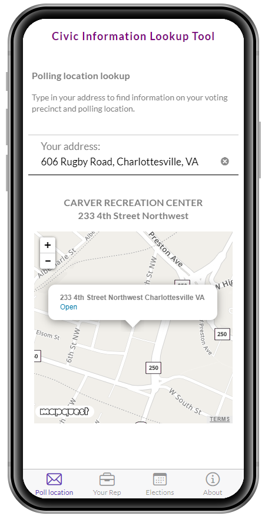
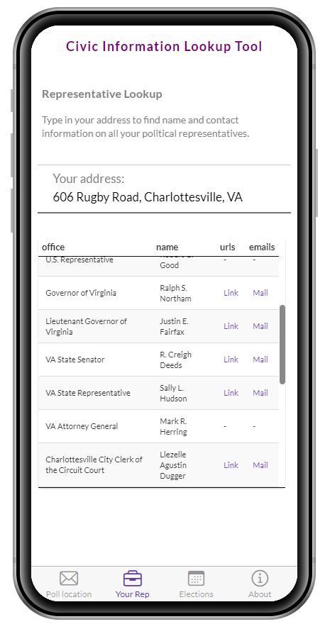
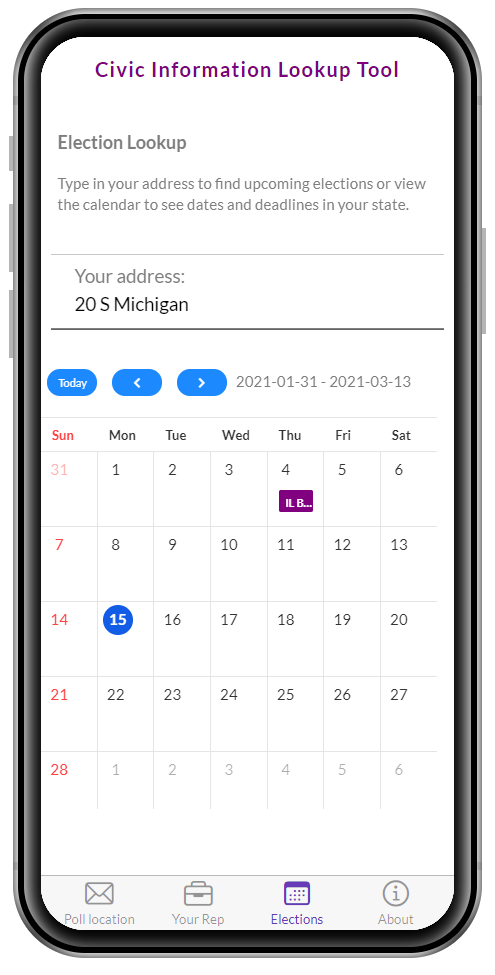
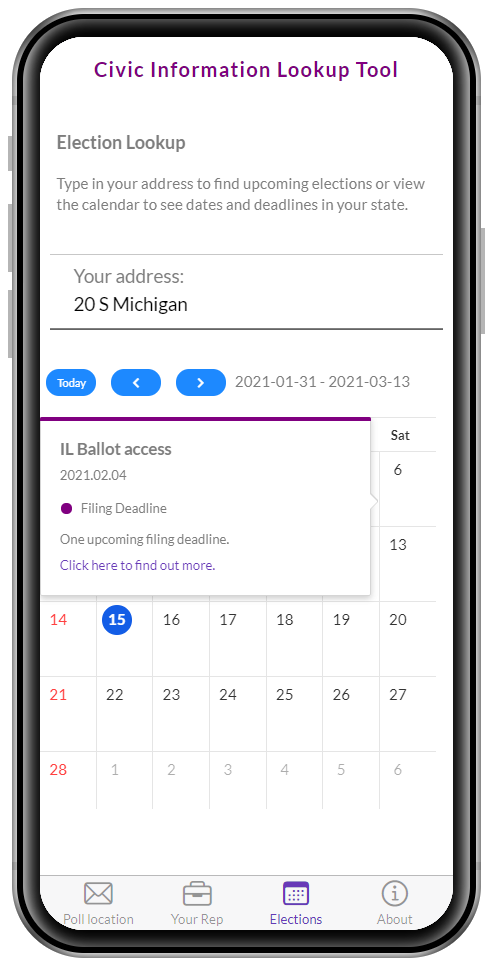

<!-- README.md is generated from README.Rmd. Please edit that file -->

```{r, include = FALSE}
knitr::opts_chunk$set(
  collapse = TRUE,
  comment = "#>"
)
```

# Civic Information Lookup application

<!-- badges: start -->
<!-- badges: end -->

The Civic Info Lookup app is a mobile app built in Shiny with an F7 shinyMobile framework. The application was built to showcase the ability to develop attractive mobile applications in Shiny and to showcase the {googlecivic} package. It utilizes the {googlecivic} package to help an individual find polling locations, contact information for their political representatives and explore upcoming elections in their state. It utilizes leaflet.js and MapQuest.js to visualize polling locations and {tuicalendr}/tui-calendar to visualize election dates and information in an attractive calendar.

# Polling information

Polling addresses are pulled from the Voter Information endpoint of the Google Civic Info API. Sanitized addresses are then sent to calls to MapQuest.js and rendered on a leaflet map.



The map tooltip contains the link to the polling location.

# Representative information

Representative information is pulled from the Representative Information by Address endpoint of the Google Civic Info API. Information is pulled for representatives from the local to the national level and available website and email information are accessible in a clean, attractive datatable.



# Upcoming elections

Information for upcoming elections are periodically scraped from the [Ballotpedia page on upcoming elections](https://ballotpedia.org/Elections_calendar) using Github Actions. Addresses are sanitized with the Voter Information API endpoint to determine state and then all elections and filing deadlines are visualized on a tui-calendar widget created by the {tuicalendr} package.

{width=40%}  
{width=40%}  

# Contact

This app includes some uptime around elections, but due to the costs of geocoding, search-ahead for address autofill, and rendering of basemaps means this application is not always live. Feel free to reach out if you are interested in a demo or want to host the application and are running into trouble with API credentials.
